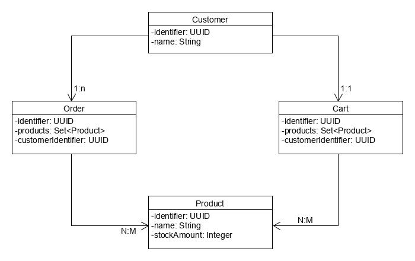
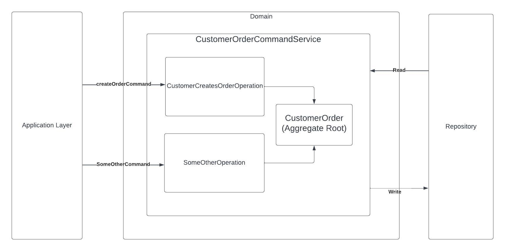

# Domain-Driven Design with Behaviour-Driven Development

### Table of Contents

1. [Overview](#Overview)
2. [Requirements](#Requirements)
3. [Model](#Model)
4. [Architecture](#Architecture)
5. [Workshop](#Workshop)

## Overview

DDD Template. Hexagonal + DDD

## Requirements

1) Java (JDK 17)
2) Maven
3) Intellij
4) Cucumber for java Intellij plugin

## Model

## Architecture

## Workshop

Steps to take:

1) create tests in [CustomerOrder.feature](./domain/service/command/src/test/resources/org.example.service.command/CustomerOrder.feature) for:
    - Functional success scenario: customer successfully creates an order, his cart gets empty, and the number of product decreases by the amount they ordered
    - Functional Errors (Optional): 
      - ORDER_ALREADY_EXISTS
      - PRODUCT_OUT_OF_STOCK
      **note:** (Errors can be found in CustomerOrderError.java)
    - Technical Exception (Optional): STORAGE_NOT_FOUND
2) Complete createOrder operation in [CustomerOrder.java](./domain/service/command/src/main/java/org/example/service/command/customerorder/domain/aggregate/CustomerOrder.java) aggregate root:
   - customer successfully creates an order, his cart gets empty, and the number of product decreases by the amount they ordered

#### Tests:

**Available personas:**

1) {testCustomer}:
   1) JP
   2) Parsa
2) {testProduct}:
   1) Jeans
   2) Shoes
   3) Tshirt
3) {testException}
   1) STORAGE_NOT_FOUND
4) {string}: can be any string written with double quotation marks ""

**Available sentences:**

1) Given:
- Customer {testCustomer}
- {testCustomer} has a Cart with items:

      | Product             |
      | {testProduct}       |
      | {testProduct}       |

- Product {testProduct} is out of stock
- Products:
2) When: 
- customer {testCustomer} orders with cart
- customer {testCustomer} order fails with error
- customer {testCustomer} order fails with exception {testException}
3) Then:
- expect the result is ok
- expect order result contain Products:
- expect order was created for {testCustomer} with Products: **DATA_TABLE** (checks if the order was created in the database with the products in the datatable)

      | Product             |
      | {testProduct}       |
      | {testProduct}       |
- expect result is error
- expect the result is unsuccessful with error {string}